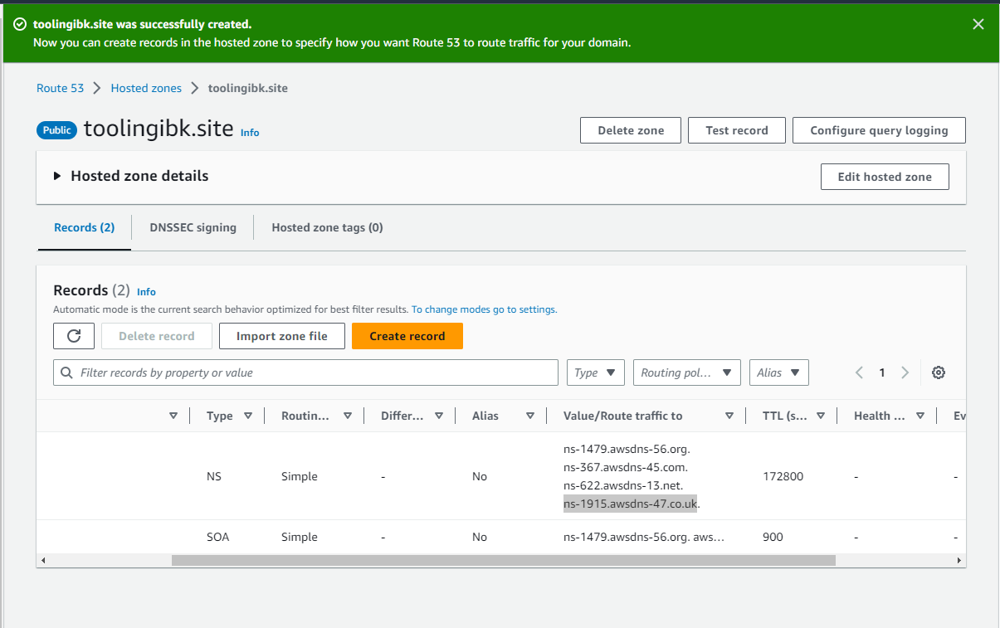

## **Documentation for Project 10**

### Updating etc Hostfile

### Configuring Nginx as Load Balancer
`sudo apt update`
`sudo apt install nginx`

### Ensuring nginx is up and running
`sudo systemctl restart nginx`
`sudo systemctl status nginx`

## **Configuring Route 53**

### creating hosted zone

### Name server Configuration

### Creating a record in Route 53 pointing to the Ip-address of our Load Balancer

### New Route 53 Record with wwww also pointing to Route 53

### Configuring NginxLB with Webserver Names defined in etc Hostfile

`sudo vi /etc/nginx/sites-available/load_balancer.conf`

### Removing default site to allow reverse proxy to redirect to our new config file and testing to ensure our Nginx config is okay

`sudo rm -f /etc/nginx/sites-enabled/default`

`sudo nginx -t`

### Linking our LB config file in site-available to site-enables to allow Nginx access our Config

`sudo ln -s ../sites-available/load_balancer.conf .`

### Accessing our newly registered Domian from URL

`http://toolingibk.site/`

## Securing our Domain

### Installing Certbot and its dependencies
`sudo apt install certbot -y`

`sudo apt install python3-certbot-nginx -y`

### Creating a certificate for our Domain to make it secure
`sudo certbot --nginx -d toolingibk.site -d www.toolingibk.site`

### Domain is secured 

### Creating a Crontab Job to automatically or periodically renew our certificate
`crontab -e`

